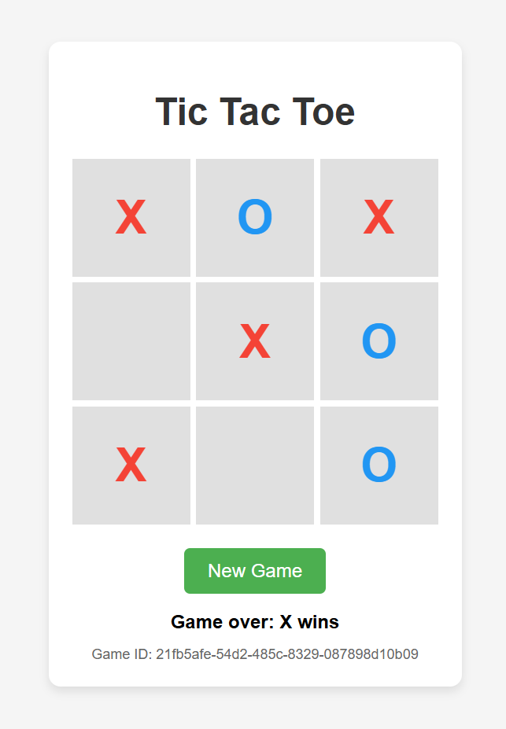

# Flask Tic-Tac-Toe API



Веб-приложение для игры в крестики-нолики с искусственным интеллектом, построенное на Flask с применением принципов чистой архитектуры и современных паттернов проектирования.

## 🎯 Архитектурные особенности

### Многослойная архитектура
Приложение построено по принципам **Clean Architecture** с четким разделением ответственности:

- **Web Layer** — REST API контроллеры, маршрутизация, HTTP модели
- **Domain Layer** — бизнес-логика, интерфейсы, доменные модели
- **DataSource Layer** — репозитории, мапперы, модели данных
- **DI Layer** — контейнер зависимостей, конфигурация

### Принципы проектирования
- **Dependency Inversion** — инверсия зависимостей через интерфейсы
- **Single Responsibility** — каждый класс имеет одну ответственность
- **Repository Pattern** — абстракция доступа к данным
- **Mapper Pattern** — преобразование между слоями
- **Singleton Pattern** — единственный экземпляр хранилища

## 🧠 Искусственный интеллект

### Алгоритм Minimax
Реализован классический алгоритм **Minimax** для создания непобедимого ИИ:
- Рекурсивный анализ всех возможных ходов
- Оценка позиций с точки зрения максимизации/минимизации
- Выбор оптимального хода для компьютера
- Гарантия лучшей возможной игры

### Стратегия игры
- ИИ всегда играет оптимально
- Невозможность проигрыша компьютера
- Адаптивность к любой стратегии игрока

## 🔧 Техническая реализация

### Потокобезопасность
- **Потокобезопасные коллекции** с использованием `multiprocessing.Manager()` 
- Менеджер обеспечивает thread-safe операции для хранения игровых сессий
- Поддержка **множественных игр** одновременно
- Безопасная работа в многопользовательской среде

### Валидация данных
- Проверка корректности игрового поля
- Валидация последовательности ходов
- Предотвращение некорректных состояний игры

### REST API архитектура
```http
POST /game/{game_uuid}
Content-Type: application/json

{
  "board": {
    "board": [[0, 1, 0], [2, 0, 1], [0, 0, 0]]
  }
}
```

## 📊 Структура данных

### Игровое поле
```python
# Представление поля как матрица 3x3
# 0 - пустая клетка
# 1 - крестик (игрок)  
# 2 - нолик (компьютер)
board = [
    [0, 1, 0],
    [2, 0, 1], 
    [0, 0, 0]
]
```

## 🏗️ Компоненты системы

### Domain Layer
- **GameServiceInterface** — интерфейс основной бизнес-логики
- **GameService** — базовая реализация с алгоритмом Minimax
- **GameServiceImpl** — расширенная реализация с поддержкой репозитория
- **Game** — доменная модель игры с UUID и игровым полем
- **GameBoard** — доменная модель игрового поля 3x3

### DataSource Layer  
- **GameRepositoryInterface** — интерфейс репозитория для доступа к данным
- **GameRepository** — конкретная реализация репозитория
- **GameStorage** — потокобезопасное хранилище с `multiprocessing.Manager()`
- **GameMapper** — преобразование между доменными моделями и моделями хранилища
- **GameEntity** — модель игры для уровня хранения данных
- **GameBoardEntity** — модель игрового поля для уровня хранения данных

### Web Layer
- **GameController** — REST API контроллер с маршрутами
- **GameWebMapper** — преобразование между доменными моделями и DTO
- **GameDTO** — модель игры для API (Data Transfer Object)
- **GameBoardDTO** — модель игрового поля для API
- **create_app()** — функция создания и настройки Flask приложения

### DI Layer
- **GameContainer** — контейнер зависимостей с паттерном Singleton
- Методы конфигурации:
  - `get_game_storage()` — создание/получение хранилища
  - `get_game_repository()` — создание репозитория
  - `get_game_service()` — создание сервиса

## 🚀 Возможности API

### Создание игры
```bash
POST /game
# Автоматически создает новую игру с уникальным UUID
```

### Получение состояния игры
```bash
GET /game/{game_id}
# Возвращает текущее состояние игры
```

### Игровой процесс
```bash
POST /game/{game_id}
# Принимает ход игрока и возвращает ответ компьютера
```

### Обработка ошибок
- `400 Bad Request` — некорректные данные или невалидный ход
- `404 Not Found` — игра не найдена
- `500 Internal Server Error` — внутренняя ошибка сервера

## 💡 Преимущества реализации

### Масштабируемость
- Модульная архитектура позволяет легко добавлять новые функции
- Слабая связанность компонентов через интерфейсы
- Возможность замены реализаций без изменения клиентского кода

### Тестируемость  
- Изолированные компоненты с четкими интерфейсами
- Dependency Injection упрощает создание mock-объектов
- Четкое разделение бизнес-логики и инфраструктуры

### Производительность
- Оптимизированный алгоритм Minimax с рекурсивным анализом
- Эффективное использование памяти с потокобезопасным хранилищем через Manager
- Минимальная латентность API

### Надежность
- Потокобезопасность всех операций через `multiprocessing.Manager()`
- Валидация всех входных данных через `validate_game_board()`
- Graceful обработка ошибок с информативными сообщениями

## 🛠️ Технологический стек

- **Python 3.10+** — основной язык разработки
- **Flask** — веб-фреймворк для REST API
- **Multiprocessing** — потокобезопасные коллекции через `Manager()`
- **UUID** — генерация уникальных идентификаторов игр
- **JSON** — сериализация данных через DTO
- **Type Hints** — статическая типизация всех компонентов
- **Dataclasses** — для создания DTO моделей

## 📦 Установка и запуск

### requirements.txt
```txt
Flask==2.3.3
```

### Установка зависимостей
```bash
pip install -r requirements.txt
```

### Запуск сервера
Из корневой директории проекта выполните:
```bash
python -m src.main
```

Приложение будет доступно по адресам:
- **http://127.0.0.1:5000** (локальный доступ)
- **http://172.19.0.1:5000** (сетевой доступ)

### Структура проекта
```
AP1_Py_T03-1/
├── requirements.txt
├── src/
│   ├── main.py
│   ├── di/
│   │   └── container.py
│   ├── web/
│   │   ├── model/
│   │   │   ├── game_dto.py
│   │   │   └── game_board_dto.py
│   │   ├── module/
│   │   │   └── app.py
│   │   ├── route/
│   │   │   └── game_controller.py
│   │   └── mapper/
│   │       └── game_mapper.py
│   ├── domain/
│   │   ├── model/
│   │   │   ├── game.py
│   │   │   └── game_board.py
│   │   └── service/
│   │       ├── game_service_interface.py
│   │       ├── game_service.py
│   │       └── game_service_impl.py
│   └── datasource/
│       ├── model/
│       │   ├── game_entity.py
│       │   └── game_board_entity.py
│       ├── repository/
│       │   ├── game_repository_interface.py
│       │   ├── game_repository.py
│       │   └── game_storage.py
│       └── mapper/
│           └── game_mapper.py
```

## 🔍 Архитектурные детали

### Поток данных между слоями
1. **HTTP Request** → `GameController`
2. **GameDTO** → `GameWebMapper` → **Domain Game**
3. **Domain Game** → `GameServiceImpl` → **Business Logic**
4. **Domain Game** → `GameRepository` → `GameMapper` → **GameEntity**
5. **GameEntity** → `GameStorage` (потокобезопасное хранение)

### Инверсия зависимостей
- `GameController` зависит от `GameServiceInterface`
- `GameServiceImpl` зависит от `GameRepositoryInterface` 
- `GameRepository` зависит от `GameStorage`
- Все зависимости внедряются через `GameContainer`

